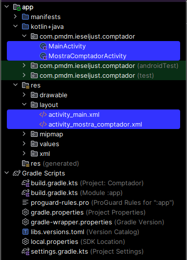
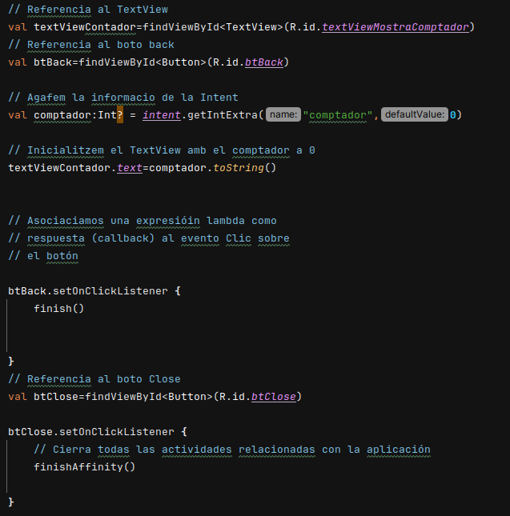

# Actividades sobre el contador
## Contador
Estructura del proyecto y ficheros más importantes marcados en azul.
Los ficheros main .kt y los .xml.

### Modificaciones iniciales
Añadir al código botones de decrementar y resetear primero en el MainActivity.kt

A continuación añadimos las siguientes líneas al activity_main.xml

Ahora añadiremos varios métodos para poder guardar los estados. Así al girar la pantalla del dispositivo mantendremos el estado anterior.

### Intents entre actividades
Pondremos un contador en la segunda pantalla, el cuál mantendrá el estado que haya dejado en la primera pantalla y además añadiremos un botón para volver atrás y uno para cerrar la app.

### Pregunta:
#### Para crear una nueva actividad, sería suficiente con crear un fichero xml con el layout y un fichero kotlin con el código para gestionarlo? 
Sí con ambos ficheros debería ser suficiente.

## Contador MVVM
Modificar el MainActivity.kt, activity_main.xml y por últimos el ComptadorViewModel.kt para añadir el botón de decrementar y resetear.

Añadimos los botones al xml

Añadimos las funciones al CVM.kt

Creamos las variables y llamamos a las funciones en el main

### Pregunta:
#### Para mostrar el valor del contador en la actividad MostraComptadorActivity, creamos una Intent y le añadimos como parámetro el valor del contador de ViewModel. Con la arquitectura MVVM, ¿este seguiría siendo necesario? ¿No podemos lanzar la Intento sin proporcionar ningún argumento? Si modificamos la segunda actividad para que haga uso también de ViewModel, ¿no podríamos acceder directamente al valor? Investiga sobre esa posibilidad.

Sí, se puede evitar accediendo directamente a MostraComptadorActivity mediante un viewmodel compartido.

## Contador con Compose
### Modifica el código necesario para añadir los botones de decrementar y resetear el contador. 
#### Para ello le será de utilidad la función componible Row, la cual nos permitirá organizar varios componibles en una fila, al igual que Column lo hacía en una columna.

Insertaremos la fila dentro de la columna y dentro de la fila añadiremos los botones que queremos que se ordenen en esta, añadiendo unos separadores Spacer para que no queden tan juntos.

Este es el resultado obtenido

